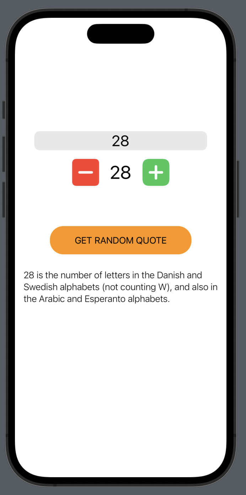

## ComposableArchitecture Example

---

```
HStack(spacing: 20) {
    Button("ADD") {
        viewStore.send(.add)
    }

    Text("\(viewStore.elapsedTime)")

    Button("SUB") {
        viewStore.send(.subtract)
    }
}
```



Reference: [https://github.com/pointfreeco/swift-composable-architecture]()
